### 안녕하세요, 백엔드 개발자 황현진입니다

Java와 Spring Boot 기반 서비스의 API·백오피스·배치를 만들고 운영하고 있고, 운영 자동화와 AI 에이전트로 영역을 넓혀가는 중입니다.

- 멤버십 포인트 플랫폼을 전담 운영하며 개인정보 암호화와 로그 마스킹을 무중단으로 적용했고, 조회에 6.6초 걸리던 운영 화면을 1ms로 줄였습니다.
- 반복되는 장애 진단을 자동화하려고, 도메인 지식과 진단 절차가 스스로 쌓이는 운영 에이전트 verified-knowledge-agent를 만들었습니다.
- 문제가 생기면 로그와 DB 이력, APM을 근거로 원인을 특정해 끝까지 책임지고 해결하려고 합니다.
- 팀에서는 추측 대신 데이터와 로그로 함께 판단할 수 있도록 근거를 정리해 공유하는 것을 중요하게 생각합니다.

---

### 경력

| 기간 | 분야 | 직위 | 담당 |
|:--|:--|:--|:--|
| `2024.07 ~ 현재` | IT 서비스 · 플랫폼 운영 | 선임 | 멤버십 포인트 플랫폼 운영·개선, 사내 시스템·전시 서비스 신규 구축 |
| `2022.05 ~ 2023.10` | 애드테크 | 사원 | 콘텐츠 제휴 플랫폼 신규 구축, 광고 운영 시스템 개발 |
| `2018.03 ~ 2021.10` | SI · 시스템 구축 | 대리 | 제조·물류·회원관리 등 SI 프로젝트 10여 건 수행 |

재직 회사·고객사명은 표기하지 않았습니다.

---

### 스킬

#### 백엔드

&nbsp;

#### 데이터

&nbsp;

#### 인프라 · 운영

&nbsp;

#### 프론트엔드

&nbsp;

#### AI · 협업

&nbsp;

---

### 프로젝트

#### 2026

#### **[verified-knowledge-agent 레포지토리](https://github.com/hhjini/verified-knowledge-agent)** `2026.03 ~ 진행 중`
- 운영 지식이 스스로 쌓이는 AI 에이전트 — 문의를 유형별로 분류해 지식베이스에서 먼저 찾고, 없으면 코드를 분석해 다시 지식으로 축적합니다. 분석마다 신뢰도 상태와 재실행 가능한 검증 쿼리를 의무화해 미검증 분석이 사실로 굳는 것을 막았습니다 (개인 프로젝트)

#### **멤버십 포인트 플랫폼 운영·개선** `2026.01 ~ 현재`
- 회원·포인트 전환·이벤트·알림톡 도메인의 사용자 API, 백오피스, 배치 전담 운영. 개인정보 암호화 체계와 WAS 로그 마스킹을 무중단 적용하고, 시크릿 관리를 AWS Secrets Manager로 이관했습니다 (실무 · 비공개)

#### 2025

#### **다국어 전시 오디오 가이드 서비스 구축** `2025.08 ~ 2025.12`
- 브랜드 전시관용 다국어 오디오 가이드 서비스의 조회 API와 운영자 백오피스 개발 (실무 · 비공개)

#### 2024

#### **외부인력 투입·철수 관리 시스템 구축** `2024.07 ~ 2024.12`
- 협력사 외부인력의 투입 신청부터 철수까지 전 과정을 온라인화한 사내 시스템을 PC웹·모바일웹으로 구축. 결재 시나리오별 메일·SMS 알림과 협업 도구 계정 자동 발급·회수 배치 개발 (실무 · 비공개)

#### 2022 – 2023

#### **콘텐츠 제휴 플랫폼 신규 구축 / 광고 운영 시스템 개발**
- 콘텐츠 제휴 플랫폼을 초기 설계부터 구축하고, 광고 운영 시스템을 개발·유지보수 (실무 · 비공개)

---
